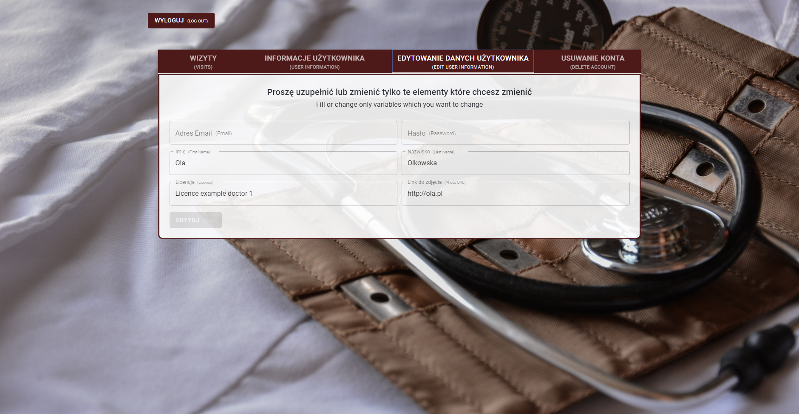
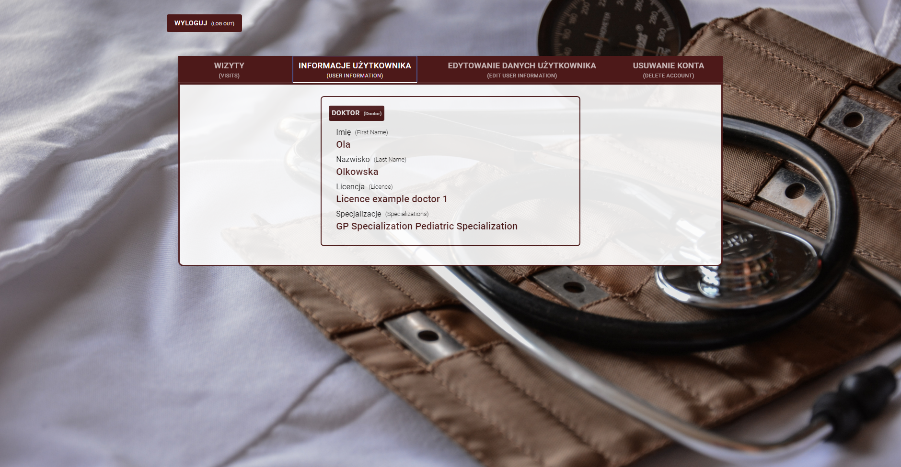
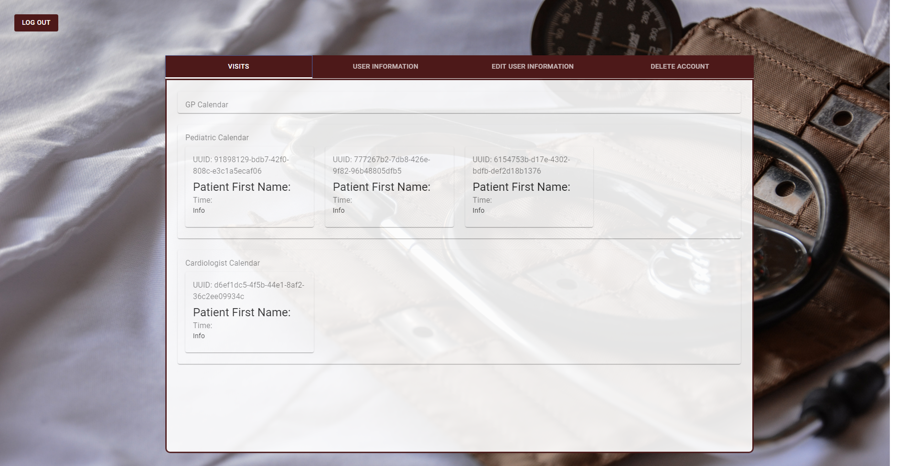

# Microservices-Clinic
Implementation of medical unit administration system based on Spring Framework. The system is set up as distributed microservices architecture with use of Spring Boot tools. Main functionality of that system is registration of users(patients, doctors), managing doctors calendars and registering patients for visits.   

## Table of contents
* [Architecture ](#architecture)
* [Tech_Stack](#tech_stack)
* [Screenshots](#screenshots)
* [TODO](#TODO)
* [Contact](#contact)

# Architecture 

### Eureka Registry
This is typical implementation of Netflix Eureka registry. In simple words, in my opinion, this is a simple version of DNS for a microservice :)
### Zuul
Service gateway is responsible for authorization. This service has 2 majors tasks, first if JWT doesn't exist and a request is directed to auth for new JWT or registration then pass this request further. Second 
if JWT exists, unpack and check if it is correct and decide if the request is allowed to reach a specific endpoint.
### Authentication
Service responsible for authentication. 
This service has two tasks. One is to register new users and keep then in DB. The second is to check if the user exists if the password is correct and return JWT. 
### Patient Doctor Clinic
These three services are the core of the whole system. Our main goal is to be able to record the patient's visit to the doctor and a whole bunch of features related to doing this right. 
### Rabbit MQ, Search, Config, Statistic
These four services aren't implemented yet. Right now we have to decide how to make communication between services less pained. 
* Rabbit MQ we have tested in other projects but ... we're wondering if Kaffka in this project not will be a better choice?
* Search after we decide Rabbit or Kaffka then we will be able to learn ElasticSearch and then implement into our system if it's will be fitted. 
* Config will be a simple typical config service, with the possibility to change the config on the fly. 
* Statistic we would like to make in .NET core MVC and check how these main two different technology play together.  
All that is right now stopped by tests. We have to do some unit and integrated tests.

### Security

### Example communication between mssc 

# Tech_Stack 
* Java 13
* Spring Boot 2 
* Netflix Eureka
* DB Postgres
* JPA / Hibernate 
* Swagger 2
* React
# Screenshots

## TODO in progress
* doctor's unitests tests and integration tests <--- move here tests from postman 
* search (kafka || rabit && elasticSearch)
* statistic mssc in .NET MVC
* config mssc 
* rewrite to use faign, hateos  

Project is in progress.

## Contact
Created by:
* [Gaudnik Wojciech](mailto:gaudnik.wojciech@gmail.com) - feel free to contact me! 
* [Adamowski Wojciech](mailto:wojtekadam1@gmail.com) our frontend master
* Walczak Weronika
